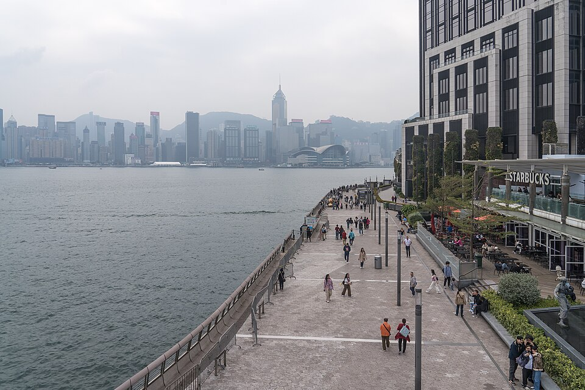
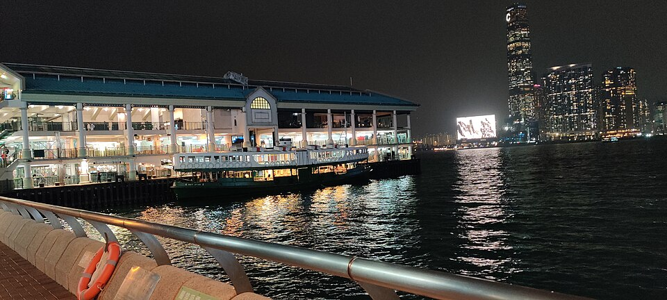
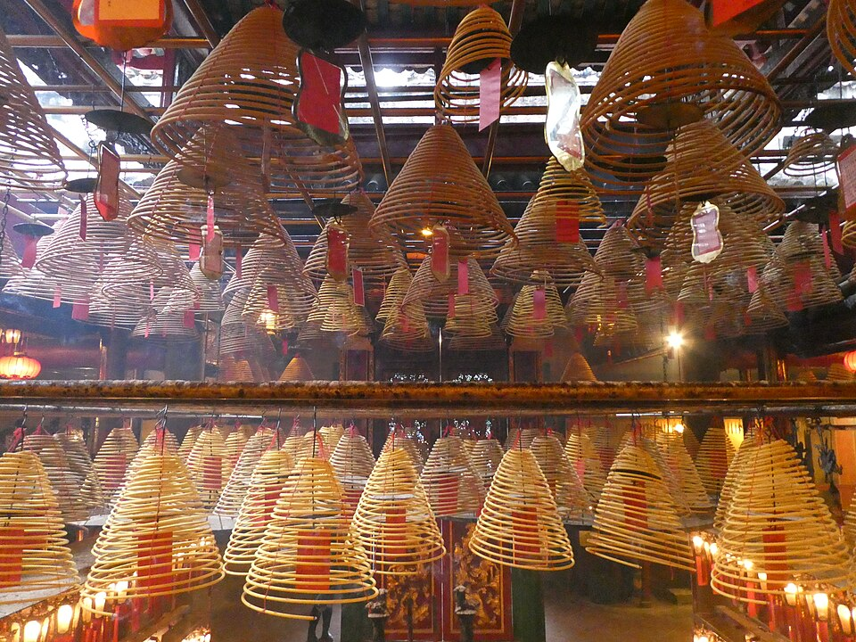
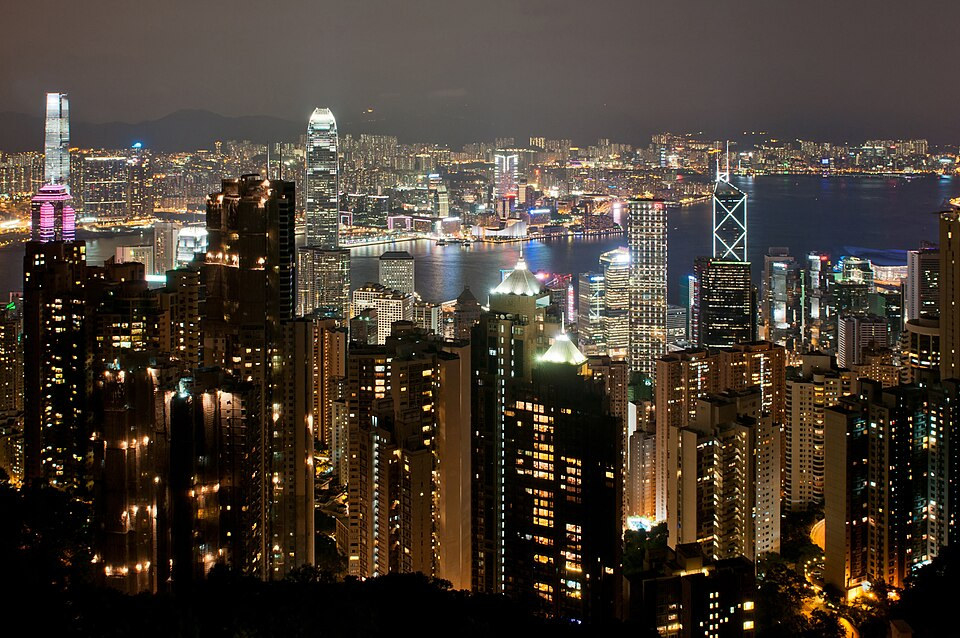
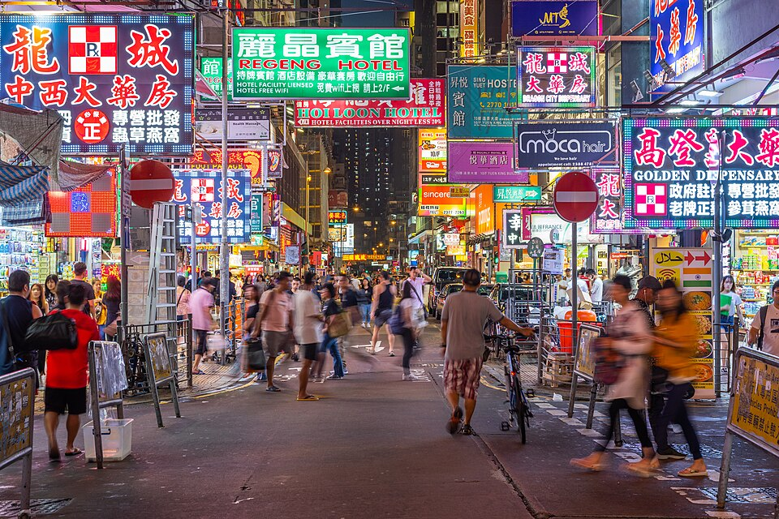
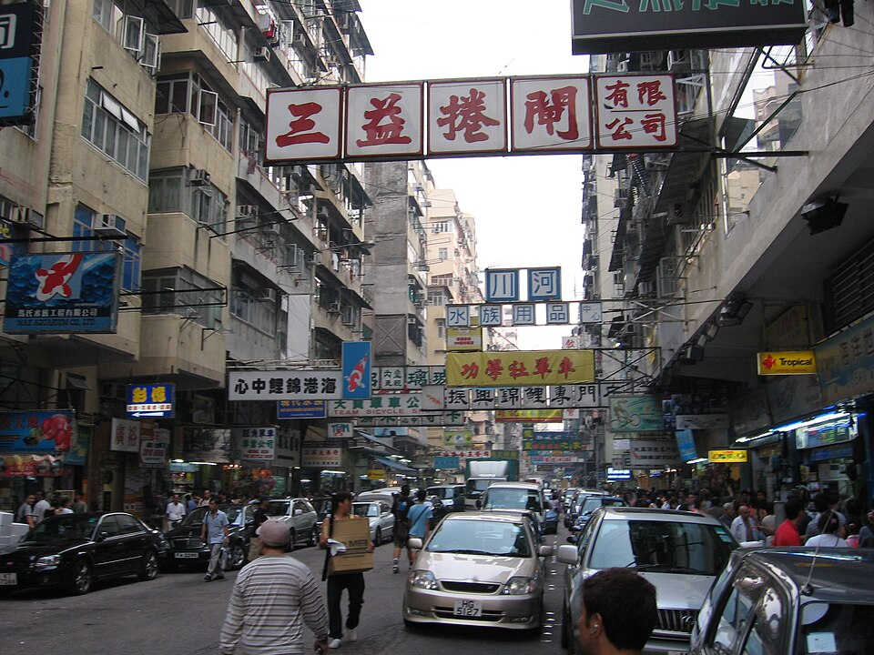

# Hong Kong

**Duración:** 2 días (noches 11 y 12 + **lun 12** y **mar 13** · tren noche a Shenzhen)

**Estado:** `borrador`
**Fichero:** `actividades/hong-kong.md`
**Resumen:** Plan D: llegada **dom 11** 21:55. **Lun 12** isla / Peak anochecer / ferry / Ladies' Market (Symphony 20:00 cabe). **Mar 13** día extra (pendiente rellenar) + tren West Kowloon **≈22:00–22:30** a Shenzhenbei.

> **Moneda:** dólares de Hong Kong (HKD, $). Regla de cabeza: **100 HKD ≈ 12 €** (÷ 8,3).

---

## Hong Kong en 30 segundos

Hong Kong es una bahía (**Victoria Harbour**) con **dos orillas**:

| Orilla | Nombre | Qué es | En tu viaje |
|--------|--------|--------|-------------|
| **Península** | **Kowloon** | Tierra firme al norte del puerto. Densa, callejera, mercados. | **Duermes aquí 2 noches** (11 y 12). Tren **mar 13** noche. |
| **Isla** | **Hong Kong Island** | La isla al sur. Rascacielos, Peak, Central. | **Lun 12** — mañana en Central / Sheung Wan; **anochecer en el Peak**. **Mar 13** extra (pendiente). |

**Regla práctica:** hotel Kowloon → ferry a la isla el lun 12 → Peak al atardecer → **ferry de vuelta ya oscuro** → **Ladies' Market**. Tren West Kowloon el **mar 13** noche.

### Mapa mental (no a escala)

```
     HONG KONG ISLAND (isla)                    KOWLOON (península — hotel)
     ─────────────────────                      ───────────────────────────

           ┌─────────────┐
           │ Victoria    │  montaña mirador
           │ Peak        │  (funicular Peak Tram)
           └──────┬──────┘
                  │ bus/bajada
           ┌──────▼──────┐         Star Ferry         ┌─────────────────┐
           │  Central    │ ◄────── (~5 min barco) ───► │ TST — muelle    │
           │  (centro)   │                             │ Avenue of Stars │
           └──────┬──────┘                             │ Symphony Lights │
                  │ a pie                              └────────┬────────┘
           ┌──────▼──────┐                                      │ metro ~5 min
           │ Sheung Wan  │                             ┌────────▼────────┐
           │ Man Mo Templ│                             │ Mong Kok        │
           └─────────────┘                             │ Ladies' Market  │
                  │                                    └────────┬────────┘
           PMQ o Tai Kwun (elegir uno)                          │ metro ~10 min
                                                                ▼
                                                       West Kowloon (tren mar 13 ≈22:00)
```

### Dónde dormir

| Barrio | Por qué | Distancia clave |
|--------|---------|-----------------|
| **TST** | Junto al muelle (Symphony of Lights, ferry). Turístico pero cómodo. | Mong Kok: 5 min MTR · West Kowloon: 10 min MTR |
| **Jordan** | Más local, buena comida, a 1 parada de TST. | Igual acceso a Mong Kok y West Kowloon |

---

## Día 1 — Llegada nocturna (dom 11/10)

**Zona:** Traslado aeropuerto → Kowloon
**Base noche:** **Happy Motel** · 242–252 Nathan Rd (Yau Tsim Mong) — ver [`reservas-detail.md`](../reservas-detail.md)

### Programa

| Hora | Actividad | Restricciones | Entrada | Notas |
|------|-----------|---------------|---------|-------|
| 21:55 | Llegada **HKG T1** (QR816) | | | Pasaporte + equipaje. |
| 22:30–23:15 | **Airport Express** → estación **Kowloon** | Último tren ≈00:48 | 105 HKD (≈13 €) /pax | ~22 min hasta Kowloon; desde ahí taxi/ metro a hotel TST o Jordan (~10 min). |
| 23:30–00:30 | Check-in hotel + cena ligera | | | Jet lag: prioridad dormir. Dim sum/congee 24 h cerca del hotel si hay hambre. |
| (opc.) | Paseo corto **Avenue of Stars** / promenade TST | | Gratis | Solo si el hotel queda a 5 min; las luces del puerto ya están encendidas. |

### Plan B — misma zona

| Actividad | Restricciones | Notas |
|-----------|---------------|-------|
| Cena en **Chungking Mansions** (curiosidad) | | Comida india/halal muy local; ambiente caótico pero icónico. |
| Directo a cama | | Lo sensato tras vuelo largo. |

### Qué es cada sitio (día 1)

Clic en **Mapa** abre Google Maps.

**Airport Express** — Tren del aeropuerto a Kowloon (~22 min). No hace falta entender más: maleta, asiento, hotel.

**TST** (Tsim Sha Tsui) — Barrio turístico del muelle: hoteles, promenade, ferry. [Mapa](https://www.google.com/maps/place/Tsim+Sha+Tsui)

**Jordan** — Vecino de TST, un poco más local. Buena base + desayunos cha chaan teng. [Mapa](https://www.google.com/maps/place/Jordan%2C+Hong+Kong)

**Avenue of Stars** — Paseo junto al agua en TST, tipo «paseo de la fama», con vistas a los rascacielos de la isla. [Mapa](https://www.google.com/maps/place/Avenue+of+Stars)



**Chungking Mansions** (plan B) — Bloque caótico en TST, famoso por comida india/halal barata.

---

## Día 2 — Isla + Peak anochecer + Ladies' Market (lun 12/10)

> El **lun 12** anochece ≈**18:04**. Peak Tram **07:30–23:00**, Sky Terrace **08:30–22:00**, Star Ferry hasta **23:30**.

**Zona:** Mañana **Hong Kong Island** · atardecer **Victoria Peak** · noche **Mong Kok**
**Base noche:** **Happy Motel** (misma reserva)

### Programa

| Hora | Actividad | Restricciones | Entrada | Notas |
|------|-----------|---------------|---------|-------|
| 09:00–09:20 | **Star Ferry** TST → Central | ≈06:30–23:30 | ≈4 HKD (≈0,5 €) | Ida de día; la vuelta será de noche. |
| 09:30–12:00 | **Central** — dim sum + paseo | | | Escaleras centrales, IFC Mall (ver Gastronomía). |
| 12:15–13:15 | **Man Mo Temple** (文武廟) + calles **Sheung Wan** | Man Mo ≈08:00–18:00 | Gratis (donación) | Incienso; toque TCM para Sandra en las hierbas. |
| 13:15–14:30 | Hueco: **PMQ** o **Tai Kwun** (uno, corto) o descanso | PMQ ≈11:00–20:00 · Tai Kwun ≈10:00–23:00 | Gratis | Recortar sin pena: el Peak no espera. |
| 14:45–16:00 | Subida al **Peak** — **bus 15** desde Central | Peak Tram ≈07:30–23:00 | Bus ≈10 HKD (≈1 €) | La cola del tram **16:00–19:00** es la peor. Combo online solo si insistís en el funicular. |
| 16:00–18:30 | **Victoria Peak** — anochecer | Sky Terrace ≈08:30–22:00 | Combo ≈88–128 HKD (≈11–15 €) o **gratis** (Lugard Road) | Puesta ≈**18:04**. Quedaros hasta que se enciendan las luces. Sky Terrace es opcional. |
| 18:30–19:10 | Bajada Peak → Central (bus 15 o tram) | Último tram 23:00 | | |
| 19:15–19:35 | **Star Ferry** Central → TST **de noche** | Hasta 23:30 | ≈4 HKD (≈0,5 €) | Ya oscuro; skyline encendido. El clásico. |
| 19:45–21:30 | **Ladies' Market** (女人街) + **Mong Kok** | Ladies' Market ≈12:00–23:30 | Gratis | **Prioridad del día.** Tung Choi St: ropa, gadgets, regateo. Cena callejera aquí. |
| 21:30 | Vuelta al hotel (TST / Jordan) | | | Sin tren: dormís en HK. |

### Plan B — misma zona

**Mañana (isla), si recortáis o llueve:**

| Actividad | Restricciones | Entrada | Notas |
|-----------|---------------|---------|-------|
| **PMQ** / **Tai Kwun** | PMQ ≈11:00–20:00 · Tai Kwun ≈10:00–23:00 | Gratis | Si el hueco de las 13:15 os sobra |
| **Graham Street Market** | Mañana | Gratis | Mercado callejero cerca de Central |
| **Cathedral + Statue Square** | | Gratis | Colonial junto al ferry |

**Si el Peak se atasca (cola / lluvia):**

| Actividad | Restricciones | Entrada | Notas |
|-----------|---------------|---------|-------|
| **Sky100** (ICC, 100 plantas) | ≈10:00–21:00 | ≈198 HKD (≈24 €) | Vistas desde Kowloon; más cerca del tren |
| **Bus 15** sin tram | | ≈10 HKD | Mejor subida si hay cola |

**Noche, si adelantáis el tren o sobra un hueco:**

| Actividad | Restricciones | Entrada | Notas |
|-----------|---------------|---------|-------|
| **Symphony of Lights** | Todos los días 20:00 | Gratis | Cabe desde TST tras el ferry (19:35) si recortáis un poco el mercado; si no, ya se ve desde Peak y ferry |
| **Temple Street Night Market** (廟街) | Puestos ≈18:00–23:00 | Gratis | Extra junto a Ladies' Market (Yau Ma Tei, 1 parada) — solo minutos sueltos |

### Qué es cada sitio (día 2)

Clic en **Mapa** abre Google Maps.

**Star Ferry** — Ferry verde y blanco que cruza el puerto en **≈5 minutos**. Une Central (isla) con TST (Kowloon). [Mapa](https://www.google.com/maps/place/Central+Star+Ferry+Pier)



**Central** — El centro de negocios: torres de cristal, IFC Mall, embarque del ferry. Aquí comes dim sum. [Mapa](https://www.google.com/maps/place/Central%2C+Hong+Kong)

**Man Mo Temple** — Templo pequeño y oscuro con **espirales gigantes de incienso** colgando del techo. [Mapa](https://www.google.com/maps/place/Man+Mo+Temple)



**Sheung Wan** — Callejuelas en pendiente, hierbas chinas, ambiente antiguo. El templo está aquí. [Mapa](https://www.google.com/maps/place/Sheung+Wan)

**PMQ** — Antigua escuela de policía, ahora tiendas de diseño local. [Mapa](https://www.google.com/maps/place/PMQ)

**Tai Kwun** — Antigua cárcel y comisaría británica restaurada: ladrillo rojo, patios, cafés. [Mapa](https://www.google.com/maps/place/Tai+Kwun)

**Victoria Peak** + **Peak Tram** — La montaña mirador. Subes en funicular (o en bus 15) y ves toda la bahía. [Mapa](https://www.google.com/maps/place/Peak+Tram+Lower+Terminus)



**Mong Kok** (旺角) — Barrio super denso: calles estrechas, neones, gente a todas horas. [Mapa](https://www.google.com/maps/place/Mong+Kok)



**Ladies' Market** (女人街) — Mercado callejero en Tung Choi Street: ropa, gadgets, recuerdos. Se regatea. Mejor tarde-noche. [Mapa](https://www.google.com/maps/place/Ladies%27+Market)



**West Kowloon** — Estación del tren a Shenzhen + paseo junto al puerto. [Mapa](https://www.google.com/maps/place/Hong+Kong+West+Kowloon+Station)

**Symphony of Lights** (plan B) — Cada noche a las **20:00** las fachadas parpadean. Se ve de pie en el muelle TST. El lun 12 cabe tras el ferry si recortáis el mercado. [Mapa](https://www.google.com/maps/place/Symphony+of+Lights+Viewing+Point)

Fotos: Wikimedia Commons. Peak: Ralf Roletschek (CC BY-SA 3.0) · Star Ferry: Thehistorianisaac (CC0) · Man Mo: Aethelfirth (CC BY-SA 4.0) · Mong Kok: Benh Lieu Song (CC BY-SA 2.0) · Ladies' Market: PookieFugglestein (CC0). Avenue of Stars (día 1): Alexkom000 (CC BY 4.0).

### Cuánto hay de un sitio a otro

Tiempos **orientativos** (metro MTR + caminar). Tarjeta **Octopus** en aeropuerto.

| Paso | Desde → Hasta | Cómo | Minutos |
|------|---------------|------|---------|
| 1 | Hotel TST/Jordan → muelle TST | A pie | **5–15** |
| 2 | TST → Central | **Star Ferry** | **≈10** (5 min barco + embarque) |
| 3 | Central → Sheung Wan | A pie cuesta abajo | **10–15** |
| 4 | Sheung Wan → PMQ **o** Tai Kwun | A pie | **10–20** (solo si hay hueco) |
| 5 | Central → Peak | **Bus 15** (evita cola del tram) o Peak Tram | **30–40** / tram **15** + cola |
| 6 | Peak → Central | Bus 15 o Peak Tram | **25–35** |
| 7 | Central → TST | **Star Ferry de noche** | **≈10** |
| 8 | TST muelle → Mong Kok | MTR Tsuen Wan Line (2 paradas) | **≈5** |
| 9 | Mong Kok → West Kowloon | MTR 1 parada o taxi | **≈10** |

**Lectura del lunes:** isla de mañana (dim sum + templo) → **Peak para la puesta ≈18:04** → bajada → **ferry ya oscuro** → **Ladies' Market** → hotel. El tren es el **mar 13**. El tram a las 16–19 h tiene la cola peor del día: mejor **bus 15** de subida.

---

## Día 3 — Hueco Kowloon + tren (mar 13/10)

**Zona:** Kowloon (a rellenar) → **West Kowloon**
**Base noche:** — (tren **≈22:00–22:30** → Shenzhenbei)

### Programa

| Hora | Actividad | Restricciones | Entrada | Notas |
|------|-----------|---------------|---------|-------|
| Mañana–tarde | **Pendiente** — día extra (Temple Street, M+, Chi Lin, o repetir isla) | | | A rellenar. |
| 20:30 | Checkout · MTR → **West Kowloon** + maletas | | | ≈10 min desde TST/Jordan. |
| 21:00 | **West Kowloon Station** — check-in + inmigración HK y China | Recomendado ≥45 min antes | | Control conjunto. |
| ≈22:00–22:30 | Tren AV → **Shenzhenbei** | Último ≈23:00 | ≈11 € /pax | Tren **a confirmar** en `plan-D.md`. |

### Plan B — misma zona

| Actividad | Restricciones | Entrada | Notas |
|-----------|---------------|---------|-------|
| **Temple Street Night Market** | Puestos ≈18:00–23:00 | Gratis | Si no lo hicisteis el lunes |
| **M+** | ≈10:00–18:00 · cierra **mar** | ≈140 HKD (≈17 €) | **Cierra martes** — no este día |
| **Chi Lin** + Nan Lian | ≈07:00–21:00 | Gratis | Encaja de mañana |

---

## Deck — fuera del itinerario

| Actividad | Zona | Restricciones | Entrada | Esfuerzo | Por qué |
|-----------|------|---------------|---------|----------|---------|
| **Tian Tan Buddha** + **Ngong Ping 360** | Lantau | Cable car ≈10:00–18:00 | Cable ≈235 HKD (≈28 €) ida/vuelta | alto | Candidato al **mar 13** (medio día) |
| **Hong Kong Disneyland** | Lantau | | ≈639 HKD (≈77 €) día | alto | Día entero; imposible en este calendario |
| **Dragon's Back** (senderismo) | Shek O | | Gratis | alto | ≈4 h con transporte; mejor con más días |
| **Macau** (excursión) | Ferry ≈1 h | | Ferry ≈171 HKD (≈21 €) + casino/ruinas | alto | Día entero; requiere otro visado/flujo |
| **Stanley Market** + Repulse Bay | Sur HK Island | | Gratis mercado | medio | ≈1 h bus desde Central; no cabe con Peak anochecer |
| **Ocean Park** | Aberdeen | | ≈498 HKD (≈60 €) | alto | Día entero parque temático |
| **Tai O** pueblo sobre el agua | Lantau oeste | | Ferry/barco local | alto | Medio día; combinado solo con Ngong Ping |
| **Chi Lin Nunnery** + **Nan Lian Garden** | Diamond Hill | ≈07:00–21:00 | Gratis | medio | Candidato al **mar 13** mañana |

## Gastronomía

Sin horario — en HK la comida es casi tan importante como el skyline.

### Platos típicos

| Plato | Descripción | Imprescindible aquí |
|-------|-------------|---------------------|
| **Dim sum** (點心) | Dumplings al vapor, carta rodante | **Sí** |
| **Char siu** (叉燒) | Cerdo asado cantonés | **Sí** |
| **Roast goose** (燒鵝) | Ganso asado crujiente | **Sí** |
| **Wonton noodles** (雲吞麵) | Wonton + fideos alga | **Sí** |
| **Egg tart** (蛋撻) | Tarta huevo (butter vs flaky) | **Sí** |
| **Pineapple bun** (菠蘿包) | Bollo mantequilla | **Sí** |
| **Milk tea** (港式奶茶) | Té con leche condensada | **Sí** |
| **Fish balls / curry fish balls** | Brochetas callejeras | — |

### Restaurantes emblemáticos

| Restaurante | Especialidad | Zona | Notas |
|-------------|--------------|------|-------|
| **Tim Ho Wan** | Dim sum Michelin económico | Varias sedes | Colas; Mong Kok u Olympian City |
| **Kam Fung** (金鳳) | Dim sum clásico | Wan Chai | Muy local, desayuno-brunch |
| **Yat Lok** (一樂) | Roast goose | Central | Pequeño, cola |
| **Tai Cheong** (泰昌) | Egg tarts | Central / TST | Cadena histórica |
| **Mak's Noodle** (麥奀) | Wonton finos | Central / varios | Cadena seria |
| **Australia Dairy Co.** | Desayuno cha chaan teng | Jordan | Cola legendaria; prisa |
| **Temple Street puestos** | Mariscos, curry, brochetas | Yau Ma Tei | Cena día 2 encaja natural |

## Compras y curiosidades

| Qué | Zona | Restricciones | Notas |
|-----|------|---------------|-------|
| **Ladies' Market** (女人街, Tung Choi St) | **Mong Kok** | ≈12:00–23:30 | **Prioridad del viaje en HK** — lun 12 ≈19:45–21:15 tras el ferry oscuro |
| **Mong Kok** calles comerciales | **Mong Kok** | | **Fa Yuen St** (Sneaker Street), **Sai Yeung Choi St** (electrónica/juguetes), ambiente más denso y local que TST |
| **Uniqlo** flagship / ediciones Asia | TST / Causeway Bay / Mong Kok | | Un toque de `intereses.md` |
| **PMQ** boutiques diseño | Central | | Producto local HK |
| **Graham Street Market** | Central | Mañana | Mercado callejero auténtico (día 2 mañana si pasáis) |
| Tienda **TCM** / hierbas | Sheung Wan | | Una parada para Sandra (farmacia tradicional) |

## Experiencias (no monumentos)

- [ ] Star Ferry de ida (mañana) y **vuelta de noche** — lun 12
- [ ] Victoria Peak al anochecer (puesta ≈18:04) — lun 12
- [ ] **Ladies' Market + Mong Kok** — lun 12 tras el ferry (**prioridad**)

## Pendiente

- [ ] Hotel TST/Jordan (**2 noches:** 11 y 12)
- [ ] Rellenar el **mar 13** (día extra)
- [ ] Elegir tren West Kowloon → Shenzhenbei **mar 13 ≈22:00–22:30** y mandar captura
- [ ] ¿Bus 15 de subida o Peak Tram combo online?
- [ ] Octopus Card al llegar (metro, ferry, bus)
- [ ] Verificar horario Peak Tram / Sky Terrace oct 2026
