# Plan A — China 2026

> Borrador vivo. Se construye poco a poco con lo que diga el usuario.
> No es reserva. Lo confirmado de verdad sigue en `reservas-summary.md` / `reservas-detail.md`.

## Mapa de la baraja

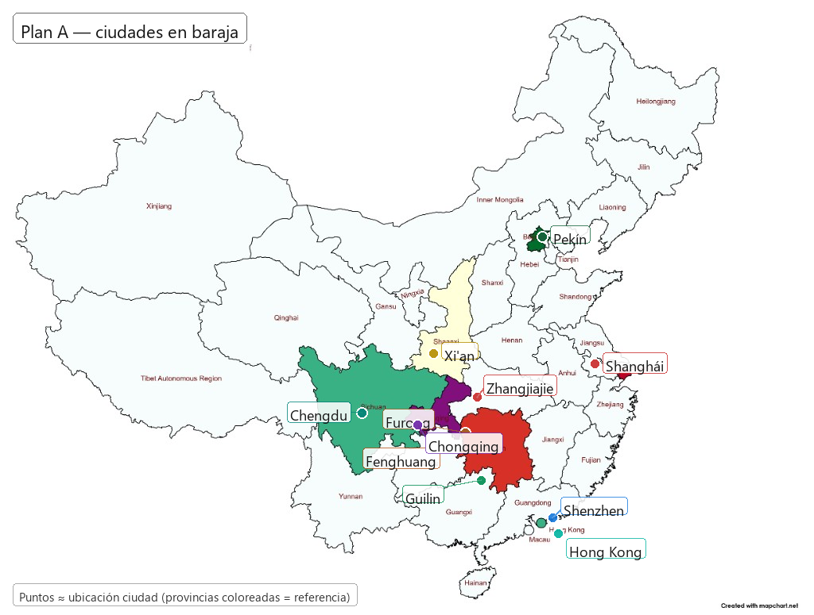

Solo puntos (sin nombres):

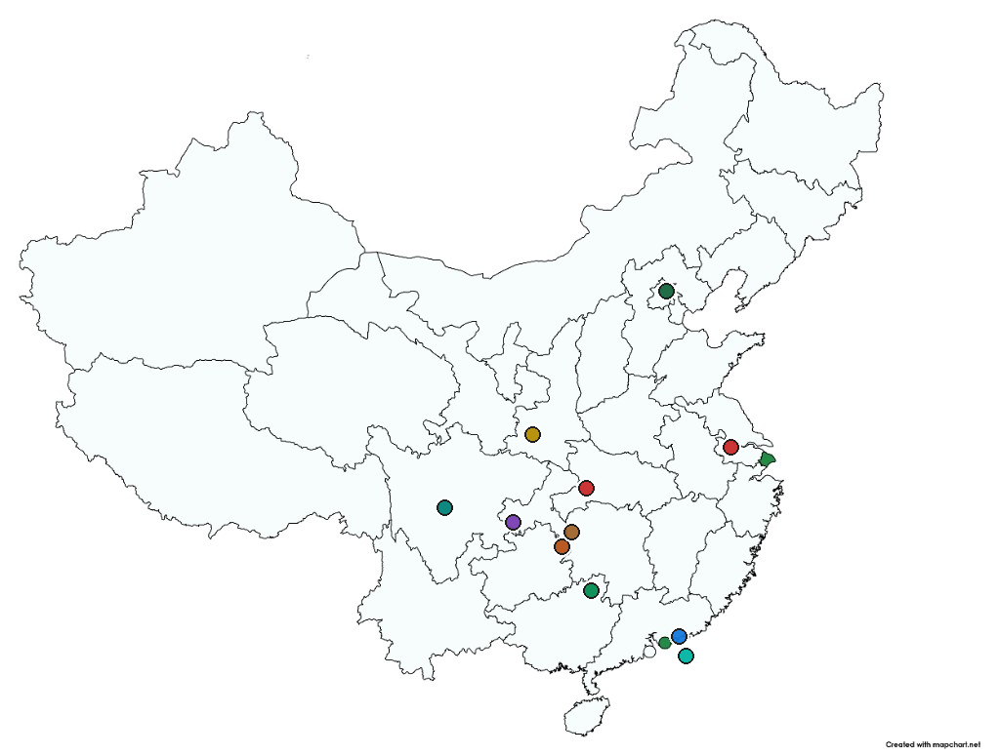

Base con provincias: [`docs/plan-A/mapa-base.png`](docs/plan-A/mapa-base.png). Base limpia: [`docs/plan-A/mapa-puntos-base.png`](docs/plan-A/mapa-puntos-base.png).

---

## Ciudades apuntadas

| Ciudad | Entrada | Salida | Duración |
|--------|---------|--------|----------|
| Hong Kong | 11/10 · 21:55 | 12/10 · 21:00 | **23 h** |
| Shenzhen | 12/10 · 22:00 | 13/10 · 18:32 | **21 h** |
| Guilin / Yangshuo | 13/10 · 21:18 | 14/10 · 14:55 | **20 h** |
| Fenghuang | 14/10 · 21:02 | 16/10 · 09:03 | **1 día 12 h** |
| Furong | 16/10 · 09:37 | 17/10 · 09:39 | **1 día** |
| Zhangjiajie | 17/10 · 10:02 | 19/10 · 19:24 | **2 días 9 h** |
| Chongqing | 19/10 · 22:10 | 21/10 · 14:05 | **1 día 16 h** |
| Chengdu | 21/10 · 15:40 | 23/10 · 19:27 | **2 días 4 h** |
| Xi'an | 24/10 · 07:08 | 25/10 · 20:35 | **1 día 13 h** |
| Pekín | 26/10 · 08:23 | 28/10 · 20:05 | **2 días 12 h** |
| Shanghái | 29/10 · 11:00 | 31/10 · 18:10 | **2 días 7 h** |

> La duración se redondea a horas completas. Las ciudades sin fechas permanecen pendientes, sin inventar tiempos.

## Cronología

| Fecha       | Qué                           | Estado                | Noches |
| ----------- | ----------------------------- | --------------------- | ------ |
| 11/10 noche | Llegada **HKG 21:55**         | Reservado (vuelos)    | — |
| 11/10 noche | Hotel en **Hong Kong**        | Pendiente buscar      | **1** |
| 12/10       | Día completo en **Hong Kong** | Fijado                | — |
| 12/10 21:00 | Salida de **Hong Kong** hacia Shenzhen | Plan A fijado provisionalmente | — |
| 12/10 22:00 | Llegada a **Shenzhen**     | Plan A fijado provisionalmente | — |
| 12/10 noche | Hotel en **Shenzhen**         | Pendiente buscar      | **1** |
| 13/10 18:32 | Salida de **Shenzhenbei** con D864 hacia Guilin | Plan A fijado provisionalmente | — |
| 13/10 21:18 | Llegada a **Guilinxi**        | Plan A fijado provisionalmente | — |
| 13/10       | Hotel en **Guilin / Yangshuo** | Pendiente buscar      | **1** |
| 14/10 14:55 | Salida de **Guilinbei** con D3968 hacia Fenghuang | Plan A fijado provisionalmente | — |
| 14/10 21:02 | Llegada a **Fenghuang Gucheng** | Plan A fijado provisionalmente | — |
| 14–15/10    | Hotel en **Fenghuang**         | Pendiente buscar      | **2** |
| 16/10 09:03 | Salida de **Fenghuang Gucheng** con G6422 hacia Furong | Plan A fijado provisionalmente | — |
| 16/10 09:37 | Llegada a **Furongzhen** | Plan A fijado provisionalmente | — |
| 16/10       | Hotel en **Furong**          | Pendiente buscar      | **1** |
| 17/10 09:39 | Salida de **Furongzhen** con G6422 hacia Zhangjiajie | Plan A fijado provisionalmente | — |
| 17/10 10:02 | Llegada a **Zhangjiajiexi** | Plan A fijado provisionalmente | — |
| 17–18/10    | Hotel en **Zhangjiajie**       | Pendiente buscar      | **2** |
| 19/10 19:24 | Salida de **Zhangjiajiexi** con G3870 hacia Chongqing | Plan A fijado provisionalmente | — |
| 19/10 22:10 | Llegada a **Chongqing Este** | Plan A fijado provisionalmente | — |
| 19–20/10    | Hotel en **Chongqing**         | Pendiente buscar      | **2** |
| 21/10 14:05 | Salida de **Chongqingxi** con G2164 hacia Chengdu | Plan A fijado provisionalmente | — |
| 21/10 15:40 | Llegada a **Chengdudong**     | Plan A fijado provisionalmente | — |
| 21–22/10    | Hotel en **Chengdu**           | Pendiente buscar      | **2** |
| 23/10 19:27 | Salida de **Chengduxi** con K998 hacia Xi'an | Plan A fijado provisionalmente | — |
| 24/10 07:08 | Llegada a **Xi'an**            | Plan A fijado provisionalmente | — |
| 24/10       | Hotel en **Xi'an**             | Pendiente buscar      | **1** |
| 25/10 20:35 | Salida de **Xi'an** con D44 hacia Pekín | Plan A fijado provisionalmente | — |
| 26/10 08:23 | Llegada a **Pekín**            | Plan A fijado provisionalmente | — |
| 26–27/10    | Hotel en **Pekín**             | Pendiente buscar      | **2** |
| 28/10 20:05 | Salida nocturna de **Pekín** con T109 hacia Shanghái | Plan A fijado provisionalmente | — |
| 29/10 11:00 | Llegada prevista a **Shanghái** con T109 desde Pekín | Plan A fijado provisionalmente | — |
| 29–30/10    | Hotel en **Shanghái**          | Pendiente buscar      | **2** |
| 31/10 18:10 | Salida **PVG**                | Reservado             | — |

### Notas del usuario (cronológicas)

- Llegada HK el 11 por la noche.
- Buscar hotel en Hong Kong.
- Estar el 12 en Hong Kong.
- Noche del 12 → Shenzhen.
- Adjunta capturas: SZ→ZJJ directo; y SZ→Guilin + Guilin→ZJJ (ver sección opciones).
- Pide mapa con ubicaciones; anotado en `docs/plan-A/mapa-ciudades.png`.
- Corrige mapa base (Shaanxi en amarillo, no Shanxi); imágenes actualizadas.
- Pregunta orden Hunan: ¿Furong/Fenghuang antes de ZJJ? (sí, geográficamente mejor).
- Confirma comprensión del tramo sur:
  `Shenzhen → [Guilin] → Fenghuang → [Furong] → Zhangjiajie → Chongqing?`
- Adjunta precios tren: SZ→FH, FH→Furong, Furong→ZJJ, ZJJ→CQ, CQ→Chengdu, Chengdu→Xi'an (sección “Precios tren”).
- Vuelve al Plan A: salida de Shanghái el 31/10 a las 18:10.
- Fija provisionalmente **2 días en Shanghái**; con el T109 Pekín→Shanghái llegaría el 29/10 a las 11:00.
---

## Tramo sur propuesto (borrador)

```
Shenzhen → [Guilin] → Fenghuang → [Furong] → Zhangjiajie → Chongqing → …
```

| Parada | Corchetes | Lectura |
|--------|-----------|---------|
| Shenzhen | fijo | noche 12 |
| Guilin | opcional pero **muy recomendable** desde SZ (tren corto/barato) |
| Fenghuang | sí si hacéis Hunan pueblos |
| Furong | opcional (de camino a ZJJ) |
| Zhangjiajie | confirmado en baraja |
| Chongqing | siguiente lógico **al oeste** tras ZJJ (luego Chengdu / norte) |

**Sí: geografía correcta** (sur → norte en Hunan, luego oeste a Chongqing).  
Lo que falta decidir: ¿Guilin sí/no?, ¿Furong sí/no?, y cuántos días en cada una.

---

## Precios tren — tramo propuesto (capturas 2026-08-18)

> Búsquedas del usuario. Precios ≈ **por persona**. Imágenes en `docs/plan-A/`. No son reservas.

Cadena cubierta:

```
Shenzhen → Fenghuang → Furong → Zhangjiajie → Chongqing → Chengdu → Xi'an
```

### 1. Shenzhenbei → Fenghuang Gucheng

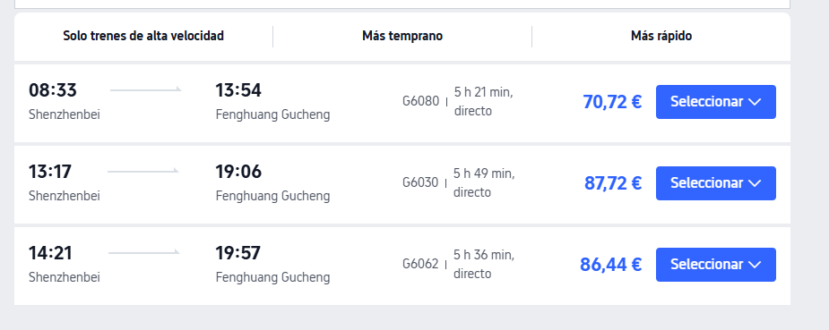

| Tren | Salida | Llegada | Duración | Precio |
|------|--------|---------|----------|--------|
| G6080 | 08:33 | 13:54 | 5 h 21 | **70,72 €** |
| G6030 | 13:17 | 19:06 | 5 h 49 | **87,72 €** |
| G6062 | 14:21 | 19:57 | 5 h 36 | **86,44 €** |

**Lectura:** directo ~5,5 h. El **08:33 / 70,72 €** es el mejor. Más barato que SZ→ZJJ (~84 €) y llegas al pueblo sin pasar por Guilin.

---

### 2. Fenghuang Gucheng → Furongzhen

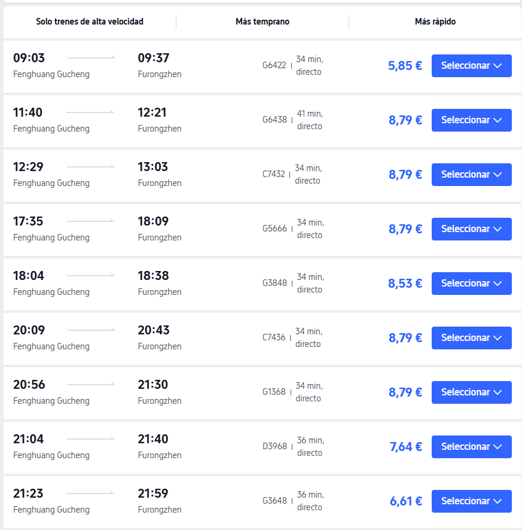

**Opción elegida provisionalmente para el 16/10:**


| Tren | Salida | Llegada | Duración | Precio |
|------|--------|---------|----------|--------|
| G6422 | 09:03 | 09:37 | 34 min | **5,85 €** |
| G6438 | 11:40 | 12:21 | 41 min | **8,79 €** |
| C7432 | 12:29 | 13:03 | 34 min | **8,79 €** |
| G5666 | 17:35 | 18:09 | 34 min | **8,79 €** |
| G3848 | 18:04 | 18:38 | 34 min | **8,53 €** |
| C7436 | 20:09 | 20:43 | 34 min | **8,79 €** |
| G1368 | 20:56 | 21:30 | 34 min | **8,79 €** |
| D3968 | 21:04 | 21:40 | 36 min | **7,64 €** |
| G3648 | 21:23 | 21:59 | 36 min | **6,61 €** |

**Lectura:** salto corto y barato (~6–9 €). Furong es casi “parada en ruta”.

---

### 3. Furongzhen → Zhangjiajiexi

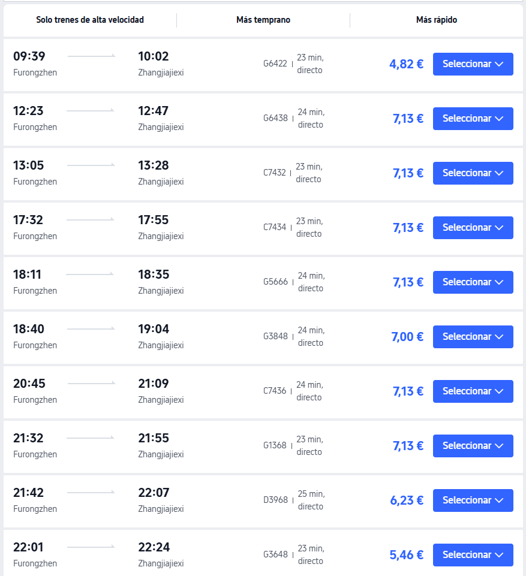

**Opción elegida provisionalmente para el 17/10:**


| Tren | Salida | Llegada | Duración | Precio |
|------|--------|---------|----------|--------|
| G6422 | 09:39 | 10:02 | 23 min | **4,82 €** |
| G6438 | 12:23 | 12:47 | 24 min | **7,13 €** |
| C7432 | 13:05 | 13:28 | 23 min | **7,13 €** |
| C7434 | 17:32 | 17:55 | 23 min | **7,13 €** |
| G5666 | 18:11 | 18:35 | 24 min | **7,13 €** |
| G3848 | 18:40 | 19:04 | 24 min | **7,00 €** |
| C7436 | 20:45 | 21:09 | 24 min | **7,13 €** |
| G1368 | 21:32 | 21:55 | 23 min | **7,13 €** |
| D3968 | 21:42 | 22:07 | 25 min | **6,23 €** |
| G3648 | 22:01 | 22:24 | 23 min | **5,46 €** |

**Lectura:** ~25 min, ~5–7 €. Encaja con mismo tren que Fenghuang→Furong (p. ej. G6422: FH 09:03 → Furong 09:37 → ZJJ 10:02).

---

### 4. Zhangjiajiexi → Chongqing

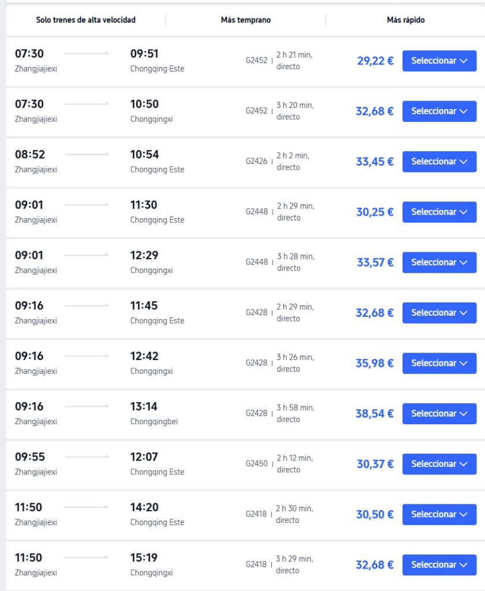

**Tren elegido provisionalmente para el 19/10:**


| Tren | Salida | Llegada | Duración | Precio |
|------|--------|---------|----------|--------|
| **G3870** | **19:24 Zhangjiajiexi** | **22:10 Chongqing Este** | **2 h 46** | **30,51 €** |

| Tren | Salida ZJJxi | Llegada | Estación CQ | Duración | Precio |
|------|--------------|---------|-------------|----------|--------|
| G2452 | 07:30 | 09:51 | Chongqing Este | 2 h 21 | **29,22 €** |
| G2452 | 07:30 | 10:50 | Chongqingxi | 3 h 20 | **32,68 €** |
| G2426 | 08:52 | 10:54 | Chongqing Este | 2 h 02 | **33,45 €** |
| G2448 | 09:01 | 11:30 | Chongqing Este | 2 h 29 | **30,25 €** |
| G2448 | 09:01 | 12:29 | Chongqingxi | 3 h 28 | **33,57 €** |
| G2428 | 09:16 | 11:45 | Chongqing Este | 2 h 29 | **32,68 €** |
| G2428 | 09:16 | 12:42 | Chongqingxi | 3 h 26 | **35,98 €** |
| G2428 | 09:16 | 13:14 | Chongqingbei | 3 h 58 | **38,54 €** |
| G2450 | 09:55 | 12:07 | Chongqing Este | 2 h 12 | **30,37 €** |
| G2418 | 11:50 | 14:20 | Chongqing Este | 2 h 30 | **30,50 €** |
| G2418 | 11:50 | 15:19 | Chongqingxi | 3 h 29 | **32,68 €** |

**Lectura:** ~2–2,5 h a **Chongqing Este** (~29–33 €) es lo más limpio. Preferir Este salvo alojamiento cerca de Xi/Bei.

---

### 5. Chongqing → Chengdu

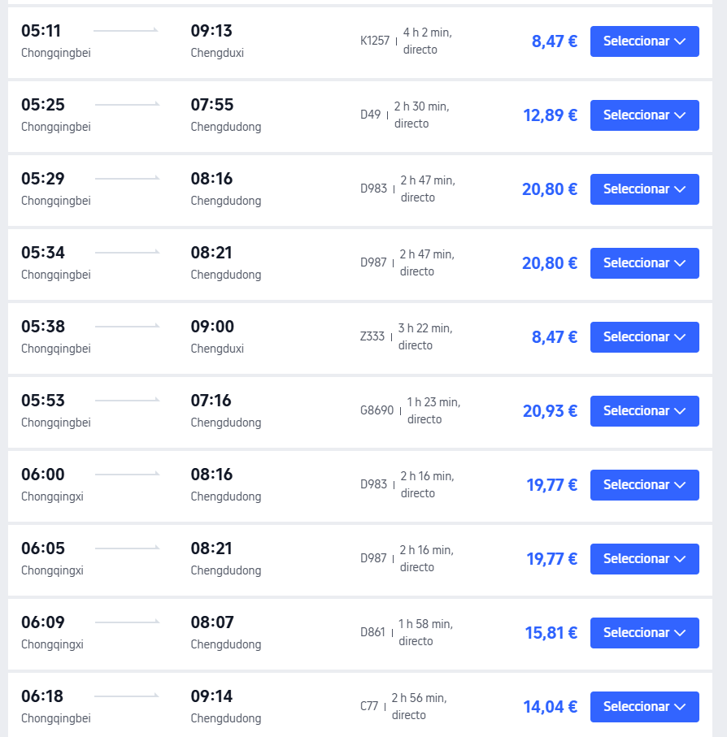

**Tren elegido provisionalmente para el 21/10:**


| Tren | Salida | Llegada | Duración | Precio |
|------|--------|---------|----------|--------|
| **G2164** | **14:05 Chongqingxi** | **15:40 Chengdudong** | **1 h 35** | **25,01 €** |

| Tren | Salida | Llegada | Duración | Precio |
|------|--------|---------|----------|--------|
| K1257 | 05:11 Chongqingbei | 09:13 Chengduxi | 4 h 02 | **8,47 €** |
| D49 | 05:25 Chongqingbei | 07:55 Chengdudong | 2 h 30 | **12,89 €** |
| D983 | 05:29 Chongqingbei | 08:16 Chengdudong | 2 h 47 | **20,80 €** |
| D987 | 05:34 Chongqingbei | 08:21 Chengdudong | 2 h 47 | **20,80 €** |
| Z333 | 05:38 Chongqingbei | 09:00 Chengduxi | 3 h 22 | **8,47 €** |
| G8690 | 05:53 Chongqingbei | 07:16 Chengdudong | 1 h 23 | **20,93 €** |
| D983 | 06:00 Chongqingxi | 08:16 Chengdudong | 2 h 16 | **19,77 €** |
| D987 | 06:05 Chongqingxi | 08:21 Chengdudong | 2 h 16 | **19,77 €** |
| D861 | 06:09 Chongqingxi | 08:07 Chengdudong | 1 h 58 | **15,81 €** |
| C77 | 06:18 Chongqingbei | 09:14 Chengdudong | 2 h 56 | **14,04 €** |

**Lectura:** tramo muy frecuente y barato. Mejor **G/D a Chengdudong** (~1,5–2,5 h, ~13–21 €) que K/Z lentos, salvo ahorro extremo.

---

### 6. Chengdudong → Xi'anbei

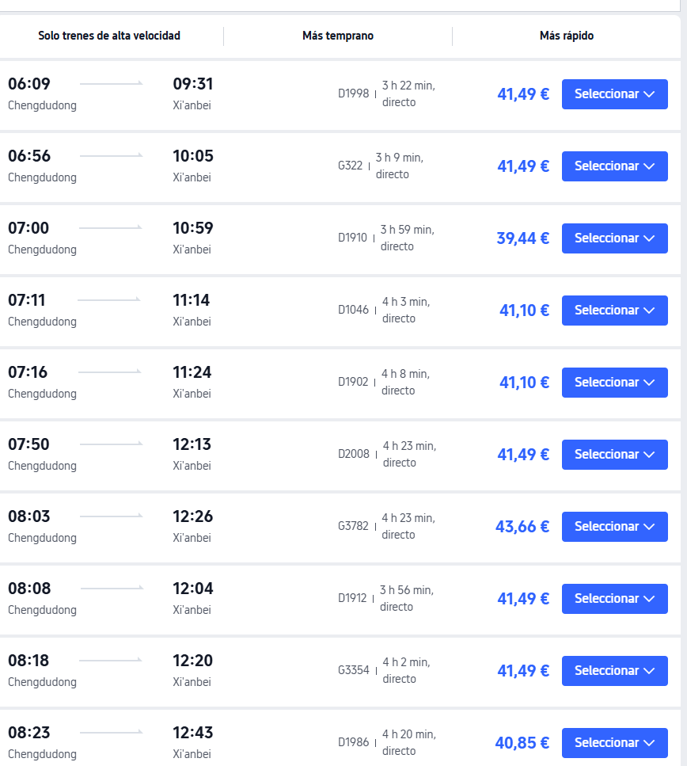

| Tren | Salida | Llegada | Duración | Precio |
|------|--------|---------|----------|--------|
| D1998 | 06:09 | 09:31 | 3 h 22 | **41,49 €** |
| G322 | 06:56 | 10:05 | 3 h 09 | **41,49 €** |
| D1910 | 07:00 | 10:59 | 3 h 59 | **39,44 €** |
| D1046 | 07:11 | 11:14 | 4 h 03 | **41,10 €** |
| D1902 | 07:16 | 11:24 | 4 h 08 | **41,10 €** |
| D2008 | 07:50 | 12:13 | 4 h 23 | **41,49 €** |
| G3782 | 08:03 | 12:26 | 4 h 23 | **43,66 €** |
| D1912 | 08:08 | 12:04 | 3 h 56 | **41,49 €** |
| G3354 | 08:18 | 12:20 | 4 h 02 | **41,49 €** |
| D1986 | 08:23 | 12:43 | 4 h 20 | **40,85 €** |

**Lectura:** ~3–4 h, ~40–44 €. El **G322 (3 h 09)** es el más rápido de la lista.

---

### Resumen costes tren (1 pax, mejores de cada captura)

#### Sin Guilin

```
SZ → Fenghuang → Furong → ZJJ → CQ → Chengdu → Xi'an
```

| Tramo | Mejor orientativo | € |
|-------|-------------------|---|
| SZ → Fenghuang | G6080 08:33 | ~71 |
| Fenghuang → Furong | G6422 | ~6 |
| Furong → ZJJ | G6422 | ~5 |
| ZJJ → Chongqing Este | G2452 07:30 | ~29 |
| Chongqing → Chengdu | D/G típico | ~13–21 |
| Chengdu → Xi'an | G322 / D1910 | ~39–41 |
| **Total** | | **~160–175 €** |

#### Con Guilin

```
SZ → Guilin → Fenghuang → Furong → ZJJ → CQ → Chengdu → Xi'an
```

| Tramo | Fuente | Mejor orientativo | € |
|-------|--------|-------------------|---|
| SZ → Guilin | captura [`shenzhen-guilin-d864.png`](docs/plan-A/shenzhen-guilin-d864.png) | D864 · **13/10 · 18:32–21:18** · 2 h 46 | **31,41 €** |
| Guilin → Fenghuang | captura [`guilin-fenghuang-d3968.png`](docs/plan-A/guilin-fenghuang-d3968.png) | D3968 · **14/10 · 14:55–21:02** · 6 h 07 | **39,07 €** |
| Fenghuang → Furong | captura | G6422 | ~6 |
| Furong → ZJJ | captura | G6422 | ~5 |
| ZJJ → Chongqing Este | captura | G2452 | ~29 |
| Chongqing → Chengdu | captura | D/G | ~13–21 |
| Chengdu → Xi'an | captura | G322 / D1910 | ~39–41 |
| **Total** | | | **~159–190 €** |

**Lectura:** en **€** casi empatan (~160–175 sin vs ~165–195 con). La diferencia real no es el dinero, es **tiempo**:

| | Sin Guilin | Con Guilin |
|---|------------|------------|
| Día 13 | SZ→Fenghuang ~5,5 h | SZ→Guilin ~3 h |
| Extra | — | **+1 día entero** Guilin→Fenghuang (~6 h tren, salidas 14:38/14:55) |
| Coste hasta ZJJ | ~71+6+5 ≈ **82 €** | ~33–40+39,06+6+5 ≈ **83–90 €** |

Guilin **compensa** si vais a hacer **2 días** allí (Yangshuo/río). Si solo es “pasar”, no merece el día de tren después.

> La captura indica **billetes en prereserva**: todavía no están a la venta. También faltan: Xi'an→Pekín, Pekín→Shanghái / PVG.

---

## Xi'an → Pekín (capturas 2026-08-18)

### Tren nocturno

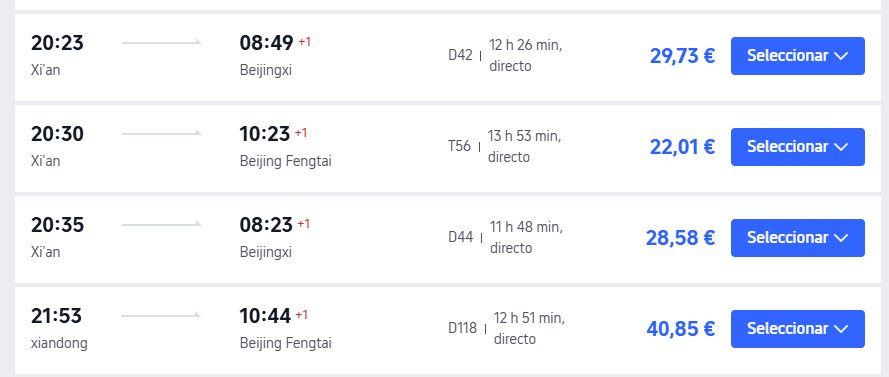

| Tren | Salida | Llegada (+1) | Duración | Precio |
|------|--------|--------------|----------|--------|
| D42 | Xi'an | Beijingxi | 20:23 → 08:49 | 12 h 26 | **29,73 €** |
| D44 | Xi'an | Beijingxi | 20:35 → 08:23 | 11 h 48 | **28,58 €** |
| T56 | Xi'an | Beijing Fengtai | 20:30 → 10:23 | 13 h 53 | **22,01 €** |

### Avión

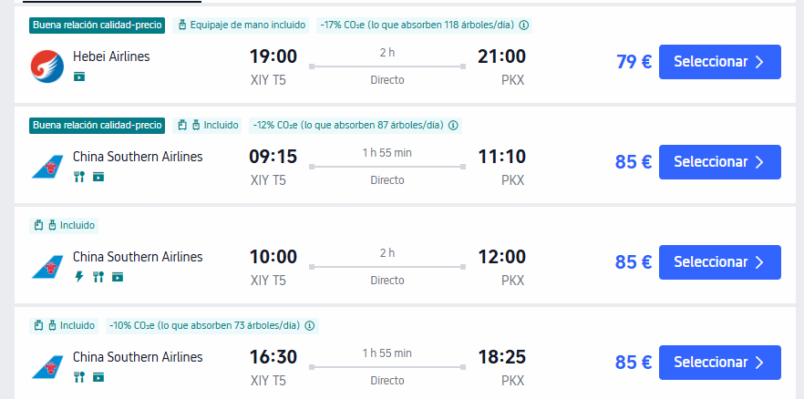

| Aerolínea | Salida | Llegada | Duración | Precio |
|-----------|--------|---------|----------|--------|
| Hebei Airlines | 19:00 | 21:00 | 2 h | **79 €** |
| China Southern | 09:15 | 11:10 | 1 h 55 | **85 €** |
| China Southern | 10:00 | 12:00 | 2 h | **85 €** |
| China Southern | 16:30 | 18:25 | 1 h 55 | **85 €** |

**Lectura:** el tren nocturno ahorra dinero y una noche de hotel, pero llega a Pekín cansado. El D44 es el mejor equilibrio de las capturas: **11 h 48 min / 28,58 €**. El vuelo cuesta ~50 € más, pero libera casi todo el día siguiente; hay que sumar desplazamientos y controles de aeropuerto.

**Pendiente de encaje:** decidir si Xi'an → Pekín se hace en tren nocturno o vuelo según cuántos días queden para Pekín y Shanghái.

### Hipótesis Chengdu → Xi'an con K998


| Fecha | Hora | Movimiento |
|-------|------|------------|
| 23/10 | 19:27 | Salida de Chengduxi con K998 |
| 24/10 | 07:08 | Llegada a Xi'an |
| 24/10 | — | Una noche en Xi'an |
| 25/10 | 20:35 | Salida de Xi'an con D44 hacia Pekín |

El calendario encaja: **salís de Chengdu el 23**, tenéis el 24 para Xi’an y una noche, y el 25 por la noche continuáis hacia Pekín. El K998 y el D44 siguen siendo hipótesis, no reservas.

### Hipótesis temporal con D44

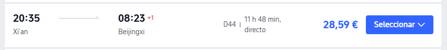

Si la salida de Pekín hacia Shanghái es el **28/10 por la noche** y queréis tener **dos noches en Pekín (26 y 27)**:

| Fecha | Hora | Movimiento |
|-------|------|------------|
| 25/10 | 20:35 | Salida de Xi'an con D44 |
| 26/10 | 08:23 | Llegada a Beijingxi |
| 26–27/10 | — | Dos noches en Pekín |
| 28/10 | noche | Salida de Pekín hacia Shanghái |

Así que sí: **llegaríais a Pekín a las 08:23 del día 26**, con dos noches allí antes de salir el 28. Es una hipótesis de calendario; el D44 sigue sin estar reservado.

---

## Pekín → Shanghái (capturas 2026-08-18)

### Avión

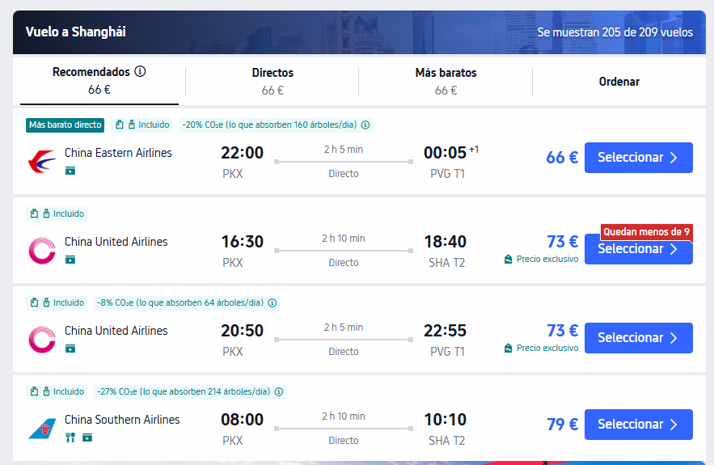

| Aerolínea | Salida | Llegada | Duración | Precio |
|-----------|--------|---------|----------|--------|
| China Eastern | 22:00 | 00:05 (+1) · PVG T1 | 2 h 05 | **66 €** |
| China United | 16:30 | 18:40 · SHA T2 | 2 h 10 | **73 €** |
| China United | 20:50 | 22:55 · PVG T1 | 2 h 05 | **73 €** |
| China Southern | 08:00 | 10:10 · SHA T2 | 2 h 10 | **79 €** |

### Tren

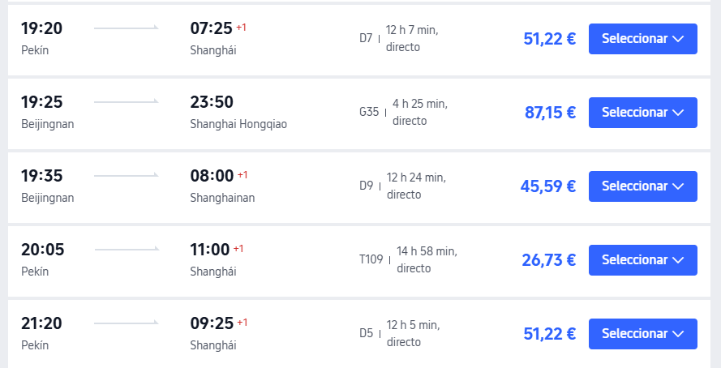

| Tren | Salida | Llegada (+1) | Duración | Precio |
|------|--------|--------------|----------|--------|
| D7 | Pekín | 19:20 → 07:25 | 12 h 07 | **51,22 €** |
| D9 | Beijingnan | 19:35 → 08:00 | 12 h 24 | **45,59 €** |
| T109 | Pekín | 20:05 → 11:00 | 14 h 58 | **26,73 €** |
| D5 | Pekín | 21:20 → 09:25 | 12 h 05 | **51,22 €** |
| G35 | Beijingnan | 19:25 → 23:50 | 4 h 25 | **87,15 €** |

**Lectura:** el vuelo más barato cuesta **66 €**, pero el tren nocturno D9 cuesta **45,59 €** y ahorra una noche de hotel. El G35 es la opción rápida de tren, pero cuesta más que el avión y llega a Hongqiao.

**Para el plan:** si Pekín es la última ciudad antes de Shanghái, el **D9/D7 nocturno** permite llegar por la mañana y aprovechar el día; el avión de las 16:30 permite llegar aún de día, pero hay que sumar desplazamiento y aeropuerto.

## Calendario (en construcción)

| Fecha | Día | Plan                                       | Base noche    |
| ----- | --- | ------------------------------------------ | ------------- |
| 10/10 | sáb | SCQ → MAD → DOH                            | avión         |
| 11/10 | dom | DOH → **HKG 21:55**                        | **Hong Kong** |
| 12/10 | lun | **Hong Kong** (día) · noche → **Shenzhen** | **Shenzhen**  |
| 13/10 | mar | Shenzhen → **¿destino?**                   | ¿?            |
| …     | …   | _(por rellenar)_                           |               |
| 28/10 | mié | Pekín → Shanghái: T109 nocturno, salida **20:05** | tren |
| 29/10 | jue | Llegada a Shanghái **11:00** con T109 · día 1 | **Shanghái** |
| 30/10 | vie | Shanghái · día 2                         | **Shanghái** |
| 31/10 | sáb | Shanghái mañana · **PVG 18:10**            | avión         |
| 01/11 | dom | MAD + AVE Santiago                         | —             |

---

## Desde Shenzhen: opciones reales (capturas)

> Capturas del usuario (prereserva / búsqueda). Precios ≈ por persona. Imágenes en `docs/plan-A/`.

### Opción 1 — Directo Shenzhen → Zhangjiajie

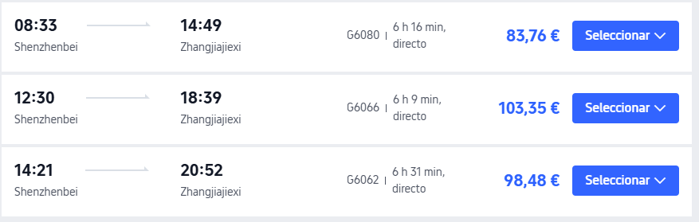

| Tren  | Salida            | Llegada             | Duración | Precio       |
| ----- | ----------------- | ------------------- | -------- | ------------ |
| G6080 | 08:33 Shenzhenbei | 14:49 Zhangjiajiexi | 6 h 16   | **83,76 €**  |
| G6066 | 12:30 Shenzhenbei | 18:39 Zhangjiajiexi | 6 h 09   | **103,35 €** |
| G6062 | 14:21 Shenzhenbei | 20:52 Zhangjiajiexi | 6 h 31   | **98,48 €**  |

**Lectura:** un solo tren, ~6–6,5 h. El de **08:33 / 83,76 €** es el más razonable (llegas a media tarde). Pierdes el día 13 en tren; no pasas por Guilin.

---

### Opción 2 — Shenzhen → Guilin → Zhangjiajie (dos saltos)

#### 2a. Shenzhen → Guilin

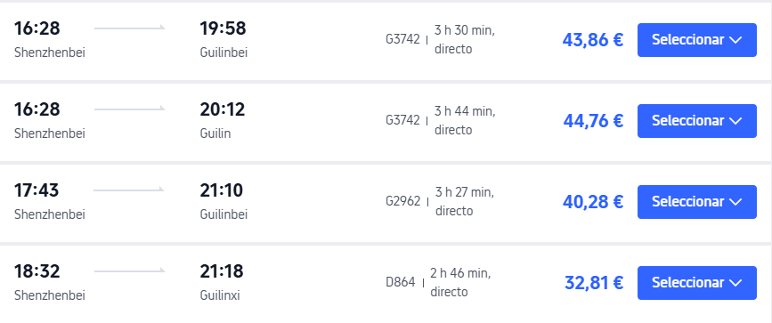

**Opción elegida provisionalmente para el 13/10:**


| Tren  | Salida            | Llegada         | Duración | Precio      |
| ----- | ----------------- | --------------- | -------- | ----------- |
| G3742 | 16:28 Shenzhenbei | 19:58 Guilinbei | 3 h 30   | **43,86 €** |
| G3742 | 16:28 Shenzhenbei | 20:12 Guilin    | 3 h 44   | **44,76 €** |
| G2962 | 17:43 Shenzhenbei | 21:10 Guilinbei | 3 h 27   | **40,28 €** |
| D864  | **18:32 Shenzhenbei** | **21:18 Guilinxi**  | **2 h 46**   | **31,41 €** |

**Lectura:** barato y corto. El **D864 (32,81 €)** es el mejor precio/tiempo, pero llega a **Guilinxi** (oeste; luego taxi/bus a ciudad o Yangshuo). **Guilinbei** suele ser más cómodo si la base es Guilin ciudad.

> Nota: estas salidas son de **tarde**. Si sales el **13 por la mañana**, habrá más trenes; conviene volver a buscar horario AM.

#### 2b. Guilin → Zhangjiajie

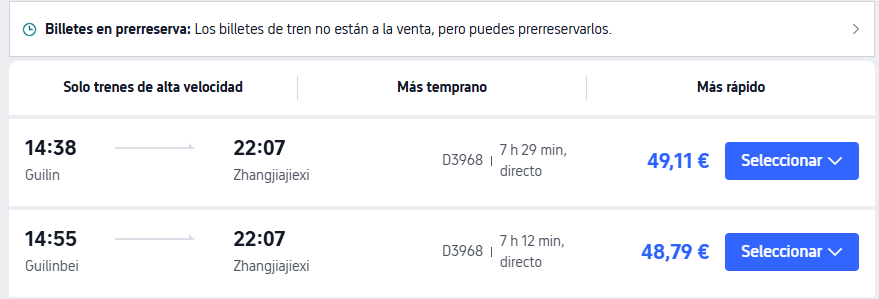

| Tren  | Salida          | Llegada             | Duración | Precio      |
| ----- | --------------- | ------------------- | -------- | ----------- |
| D3968 | 14:38 Guilin    | 22:07 Zhangjiajiexi | 7 h 29   | **49,11 €** |
| D3968 | 14:55 Guilinbei | 22:07 Zhangjiajiexi | 7 h 12   | **48,79 €** |

**Lectura:** mismo tren D3968; llega **noche** (~22:07). Hay que contar **1 día de traslado** Guilin→ZJJ (casi entero). Banner: billetes aún en **prereserva**.

---

### Comparativa rápida (1 pax, orientativo)

| Ruta                  | Tiempo en tren            | Coste aprox.                      | Días “quemados” en traslado | Qué ganas                                    |
| --------------------- | ------------------------- | --------------------------------- | --------------------------- | -------------------------------------------- |
| **SZ → ZJJ directo**  | ~6–6,5 h                  | **~84–103 €**                     | 1 (día 13)                  | Llegas antes a Avatar; Guilin aparte o fuera |
| **SZ → Guilin → ZJJ** | ~3 h + ~7 h ≈ **10–11 h** | **~33+49 ≈ 82 €** (si D864+D3968) | 1 corto + 1 largo           | Encas Guilin _y_ ZJJ; más noches en el sur   |

Coste similar (~80–100 €), pero la vía Guilin **suma un día de tren largo** después. Compensa si quieres **2+ días en Guilin/Yangshuo** entre medias.

### Recomendación (sigue abierta)

- Si **Guilin importa**: Opción 2 (noche 12 Shenzhen → tren 13 a Guilin; luego ZJJ cuando toque).
- Si **ZJJ primero / menos paradas**: Opción 1, tren **08:33 G6080**.

---

## Orden Hunan: ¿ZJJ directo o Fenghuang/Furong antes?

> Pregunta del usuario: ¿ruta óptima Guilin→ZJJ, o mejor Furong/Fenghuang antes de Zhangjiajie?

### Geografía (sur → norte)

```
Guilin (sur)
    ↓
Fenghuang  ≈  Furong   ← mismos “puntos marrones” del mapa, el de abajo
    ↓
Zhangjiajie              ← punto marrón de arriba
```

Fenghuang y Furong quedan **entre** Guilin y Zhangjiajie (más al sur que ZJJ). Ir **Guilin → ZJJ** y luego bajar a Fenghuang es **deshacer camino**.

### Orden óptimo si mantenéis pueblos + parque

```
Shenzhen → Guilin/Yangshuo → Fenghuang → (Furong) → Zhangjiajie → … (Sichuan/norte) → Shanghái
```

| Orden                                 | Veredicto                                                                                   |
| ------------------------------------- | ------------------------------------------------------------------------------------------- |
| **Guilin → Fenghuang → Furong → ZJJ** | **Óptimo** en mapa: avanzáis siempre hacia el norte                                         |
| Guilin → ZJJ → Fenghuang/Furong       | Peor: retroceso sur tras el parque                                                          |
| SZ → ZJJ directo → luego Fenghuang    | Tiene sentido solo si **omitís Guilin** o lo dejáis para otro momento (raro con salida PVG) |

**Furong:** opcional; está en la línea hacia ZJJ. Si el tiempo aprieta, **Fenghuang sí / Furong no** sigue siendo buena ruta.

### Pendiente

- [ ] ¿Tras Shenzhen = **Guilin**, **ZJJ directo**, u otra?
- [ ] ¿Bloque Hunan = **Fenghuang → (Furong) → ZJJ** (recomendado) o ZJJ primero?
- [ ] Hotel Hong Kong (zona: ¿turismo el 12, o cerca paso a Shenzhen?)
- [ ] Cómo cruzar HK → Shenzhen noche del 12 (MTR + frontera; Lo Wu / Futian)
