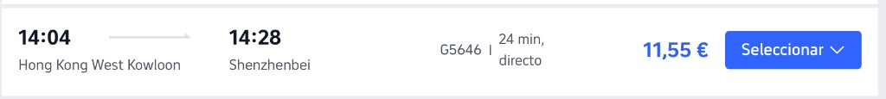
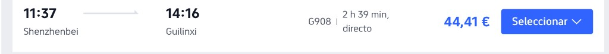
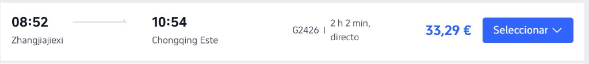

# Plan C — China 2026

> Borrador vivo. Se construye poco a poco con lo que diga el usuario.
> Este fichero **no es reserva**. Lo confirmado de verdad sigue en `reservas-summary.md` / `reservas-detail.md`.
> Reservas en `reservas-summary.md` / `reservas-detail.md`. El resto del plan se va fijando aquí (provisional hasta confirmar).

---

## Ciudades apuntadas

| Ciudad | Entrada | Salida | Duración |
|--------|---------|--------|----------|
| Hong Kong | **dom** 11/10 · 21:55 (HKG) | **mar** 13/10 · 14:04 (West Kowloon) | **1 día 16 h** |
| Shenzhen | **mar** 13/10 · 14:28 (Shenzhenbei) | **jue** 15/10 · 11:37 (Shenzhenbei) | **1 día 21 h** |
| Guilin / Yangshuo | **jue** 15/10 · 14:16 (Guilinxi) | — | — |
| Zhangjiajie | — | **jue** 23/10 · 08:52 (Zhangjiajiexi) | — |
| Chongqing | **jue** 23/10 · 10:54 (Chongqing Este) | **sáb** 25/10 · 14:35 (Shapingba) | **2 días 4 h** |
| Chengdu | **sáb** 25/10 · 15:50 (Chengdudong) | **lun** 26/10 · 11:15 (TFU T2) | **19 h** |
| Pekín | **lun** 26/10 · 13:55 (PKX) | **jue** 29/10 · 11:00 (Beijingnan) | **2 días 21 h** |
| Shanghái | **jue** 29/10 · 15:35 (Hongqiao) | **sáb** 31/10 · 18:10 (PVG) | **2 días 3 h** |

> Hong Kong: noche del 11 + día 12 + mañana/tarde del 13 antes del G5646. Shenzhen: tarde del 13 + día 14 + mañana del 15 antes del G908. Guilin/Yangshuo: tarde del 15 en adelante (salida pendiente → ZJJ). Chongqing: tarde del 23 + 24 + mañana del 25 (drones sáb) antes del G8626. Chengdu: tarde del 25 + noche + mañana del 26 antes del vuelo. Pekín: tarde del 26 + 27–28 + mañana del 29 antes del G23. Shanghái: tarde del 29 + 30 + mañana del 31 antes del vuelo PVG.

---

## Cronología

| Fecha | Día | Qué | Estado |
|-------|-----|-----|--------|
| 10/10 14:37 | sáb | AVE Santiago → Chamartín (FUFRG9) · 17:37 | Reservado |
| 10/10 16:26 | sáb | AVLO Santiago → Chamartín (2NXU56) · 19:51 | Reservado |
| 10/10 22:45 | sáb | QR152 MAD → DOH (9O7N2T) · 06:35 (+1) | Reservado |
| 11/10 09:00 | dom | QR816 DOH → HKG (9O7N2T) · **21:55** | Reservado |
| 13/10 14:04 | mar | Salida **Hong Kong West Kowloon** con **G5646** hacia Shenzhenbei · 14:28 | Fijado provisionalmente |
| 13/10 14:28 | mar | Llegada a **Shenzhenbei** | Fijado provisionalmente |
| 15/10 11:37 | jue | Salida **Shenzhenbei** con **G908** hacia Guilinxi · 14:16 | Fijado provisionalmente |
| 15/10 14:16 | jue | Llegada a **Guilinxi** | Fijado provisionalmente |
| 23/10 08:52 | jue | Salida **Zhangjiajiexi** con **G2426** hacia Chongqing Este · 10:54 | Fijado provisionalmente |
| 23/10 10:54 | jue | Llegada a **Chongqing Este** | Fijado provisionalmente |
| 25/10 14:35 | sáb | Salida **Chongqing Shapingba** con **G8626** hacia Chengdudong · 15:50 | Fijado provisionalmente |
| 25/10 15:50 | sáb | Llegada a **Chengdudong** | Fijado provisionalmente |
| 26/10 11:15 | lun | Vuelo **Chengdu TFU T2 → Pekín PKX** (China United) · 13:55 | Fijado provisionalmente |
| 26/10 13:55 | lun | Llegada a **Pekín PKX** | Fijado provisionalmente |
| 29/10 11:00 | jue | Salida **Beijingnan** con **G23** hacia Shanghái Hongqiao · 15:35 | Fijado provisionalmente |
| 29/10 15:35 | jue | Llegada a **Shanghái Hongqiao** | Fijado provisionalmente |
| 31/10 18:10 | sáb | QR869 PVG → DOH (9O7N2T) · 23:10 | Reservado |
| 01/11 02:35 | dom | IB392 DOH → MAD (9O7N2T) · 09:05 | Reservado |
| 01/11 14:40 | dom | AVE Chamartín → Santiago (2NXU56) · 17:42 | Reservado |

### Tren Hong Kong → Shenzhen (13/10)

| | |
|---|---|
| Tren | **G5646** · directo (alta velocidad HK) |
| Salida | **mar** 13/10 · 14:04 · Hong Kong **West Kowloon** |
| Llegada | **mar** 13/10 · 14:28 · **Shenzhenbei** |
| Duración | 24 min |
| Precio | 11,55 € por persona |

### Tren Shenzhen → Guilin (15/10)

| | |
|---|---|
| Tren | **G908** · directo |
| Salida | **jue** 15/10 · 11:37 · **Shenzhenbei** |
| Llegada | **jue** 15/10 · 14:16 · **Guilinxi** |
| Duración | 2 h 39 min |
| Precio | 44,41 € por persona |

### Tren Pekín → Shanghái (29/10)

| | |
|---|---|
| Tren | **G23** · directo |
| Salida | **jue** 29/10 · 11:00 · Beijingnan |
| Llegada | **jue** 29/10 · 15:35 · Shanghai Hongqiao |
| Duración | 4 h 37 min |
| Precio | 91,17 € por persona |

### Vuelo Chengdu → Pekín (26/10)

| | |
|---|---|
| Aerolínea | China United Airlines · directo · equipaje incluido |
| Salida | **lun** 26/10 · 11:15 · Chengdu **TFU T2** |
| Llegada | **lun** 26/10 · 13:55 · Pekín **PKX** |
| Duración | 2 h 40 min |
| Precio | 99 € por persona |

### Tren Zhangjiajie → Chongqing (23/10)

| | |
|---|---|
| Tren | **G2426** · directo |
| Salida | **jue** 23/10 · 08:52 · **Zhangjiajiexi** |
| Llegada | **jue** 23/10 · 10:54 · Chongqing **Este** |
| Duración | 2 h 02 min |
| Precio | 33,29 € por persona |

### Tren Chongqing → Chengdu (25/10)

| | |
|---|---|
| Tren | **G8626** · directo |
| Salida | **sáb** 25/10 · 14:35 · Chongqing **Shapingba** |
| Llegada | **sáb** 25/10 · 15:50 · **Chengdudong** |
| Duración | 1 h 15 min |
| Precio | 21,85 € por persona |

> El **sáb 25/10** coincide con el show de drones en Chongqing (魅力重庆); habrá que encajar la mañana/tarde en CQ antes del tren.
