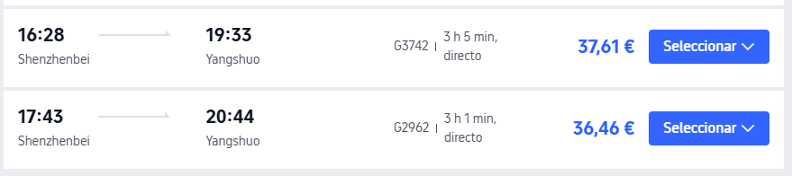
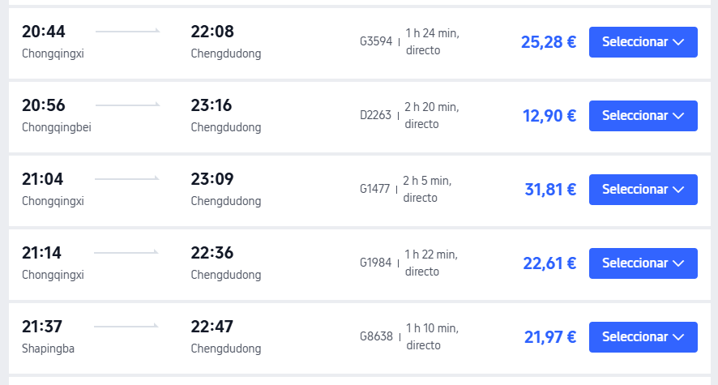

# Plan D — China 2026

> **Plan activo.** **No es reserva.**
> Lo confirmado sigue en `reservas-summary.md` / `reservas-detail.md`.

---

## Ciudades apuntadas

| Ciudad | Entrada | Salida | Duración |
|--------|---------|--------|----------|
| Hong Kong | **dom** 11/10 · 21:55 (HKG) | **mar** 13/10 · ≈22:00 (West Kowloon) | **2 días** |
| Shenzhen | **mar** 13/10 · ≈22:20 (Shenzhenbei) | **jue** 15/10 · 17:43 (Shenzhenbei) | **1 día 19 h** |
| Yangshuo | **jue** 15/10 · 20:44 (Yangshuo) | **dom** 18/10 · 09:29 (Guilin) | **2 días 13 h** |
| Zhangjiajie | **dom** 18/10 · 16:29 (Zhangjiajiexi) | **jue** 22/10 · 20:48 (Zhangjiajiexi) | **4 días 4 h** |
| Chongqing | **jue** 22/10 · 22:55 (Chongqing Este) | **dom** 25/10 · 20:56 (Chongqingbei) | **2 días 22 h** |
| Chengdu | **dom** 25/10 · 23:16 (Chengdudong) | **mié** 28/10 · 10:00 (TFU T2) | **2 días 11 h** |
| Shanghái | **mié** 28/10 · 12:45 (PVG T2) | **sáb** 31/10 · 18:10 (PVG) | **3 días 5 h** |

> Hong Kong: noches 11 y 12 + **lun 12** y **mar 13**; tren **≈22:00** a Shenzhen (a confirmar). Shenzhen: noche del 13 + día 14 + **jue 15** antes del G2962. Yangshuo: noche del 15 + **vie 16** y **sáb 17** días completos; **dom 18** madrugada a Guilin y D3970. Crucero **descartado**. Zhangjiajie: tarde 18 → 22 (parque) + **jue 22** noche G2442. Chongqing: noche del 22 + 23–24 + **dom 25** hasta el D2263 20:56. Drones **descartados**. Chengdu: noche del 25 + **26–27** + mañana del 28. Shanghái: tarde del 28 (PVG 12:45) + 29–30 + mañana del 31. Horas de trenes/vuelo **sin cambio**; solo fechas.

---

## Cronología

| Fecha | Día | Qué | Estado |
|-------|-----|-----|--------|
| 10/10 14:37 | sáb | AVE Santiago → Chamartín (FUFRG9) · 17:37 | Reservado |
| 10/10 16:26 | sáb | AVLO Santiago → Chamartín (2NXU56) · 19:51 | Reservado |
| 10/10 22:45 | sáb | QR152 MAD → DOH (9O7N2T) · 06:35 (+1) | Reservado |
| 11/10 09:00 | dom | QR816 DOH → HKG (9O7N2T) · **21:55** | Reservado |
| 13/10 ≈22:00 | mar | Salida **Hong Kong West Kowloon** → Shenzhenbei (tren a confirmar) | A elegir · franja ≈22:00–22:30 |
| 13/10 ≈22:20 | mar | Llegada a **Shenzhenbei** | A elegir |
| 15/10 17:43 | jue | Salida **Shenzhenbei** con **G2962** hacia Yangshuo · 20:44 | Fijado provisionalmente |
| 15/10 20:44 | jue | Llegada a **Yangshuo** | Fijado provisionalmente |
| 16/10 | vie | Día completo **Yangshuo** (Yulong / countryside) | Fijado provisionalmente |
| 17/10 | sáb | Día completo **Yangshuo** (Xingping / miradores) | Fijado provisionalmente |
| 18/10 09:29 | dom | Salida **Guilin** con **D3970** hacia Zhangjiajiexi · 16:29 | Fijado provisionalmente |
| 18/10 16:29 | dom | Llegada a **Zhangjiajiexi** | Fijado provisionalmente |
| 22/10 20:48 | jue | Salida **Zhangjiajiexi** con **G2442** hacia Chongqing Este · 22:55 | Fijado provisionalmente |
| 22/10 22:55 | jue | Llegada a **Chongqing Este** | Fijado provisionalmente |
| 25/10 20:56 | dom | Salida **Chongqingbei** con **D2263** hacia Chengdudong · 23:16 | Fijado provisionalmente |
| 25/10 23:16 | dom | Llegada a **Chengdudong** | Fijado provisionalmente |
| 28/10 10:00 | mié | Vuelo **Chengdu TFU T2 → Shanghái PVG T2** (Air China) · 12:45 | Fijado provisionalmente |
| 28/10 12:45 | mié | Llegada a **Shanghái PVG T2** | Fijado provisionalmente |
| 31/10 18:10 | sáb | QR869 PVG → DOH (9O7N2T) · 23:10 | Reservado |
| 01/11 02:35 | dom | IB392 DOH → MAD (9O7N2T) · 09:05 | Reservado |
| 01/11 14:40 | dom | AVE Chamartín → Santiago (2NXU56) · 17:42 | Reservado |

### Tren Hong Kong → Shenzhen (13/10)

| | |
|---|---|
| Tren | AV West Kowloon → **Shenzhenbei** · **a confirmar** |
| Salida | **mar** 13/10 · **≈22:00–22:30** · Hong Kong **West Kowloon** |
| Llegada | **mar** 13/10 · **≈22:20–22:50** · **Shenzhenbei** |
| Duración | ≈15–25 min |
| Precio | ≈11 € por persona (2ª) |

> Mismas horas; un día más tarde. HK = noches 11 y 12 + **lun 12** y **mar 13**. Symphony of Lights (20:00) cabe el **lun 12**. Manda captura cuando elijas.

### Tren Shenzhen → Yangshuo (15/10)

| | |
|---|---|
| Tren | **G2962** · directo |
| Salida | **jue** 15/10 · 17:43 · **Shenzhenbei** |
| Llegada | **jue** 15/10 · 20:44 · **Yangshuo** |
| Duración | 3 h 1 min |
| Precio | 36,46 € por persona |

> Tres noches en Yangshuo (15, 16 y 17). **Dom 18** madrugada: traslado Yangshuo → Guilin para el D3970.

### Tren Guilin → Zhangjiajie (18/10)

| | |
|---|---|
| Tren | **D3970** · directo (mismo horario) |
| Salida | **dom** 18/10 · 09:29 · **Guilin** |
| Llegada | **dom** 18/10 · 16:29 · **Zhangjiajiexi** |
| Duración | 7 h |
| Precio | 48,87 € por persona |

### Tren Zhangjiajie → Chongqing (22/10)

| | |
|---|---|
| Tren | **G2442** · directo (mismas horas) |
| Salida | **jue** 22/10 · 20:48 · **Zhangjiajiexi** |
| Llegada | **jue** 22/10 · 22:55 · Chongqing **Este** |
| Duración | 2 h 7 min |
| Precio | 30,40 € por persona |

> ZJJ gana 1 día (llegada +1 por HK y salida +1 extra). Chongqing dura lo mismo.

### Tren Chongqing → Chengdu (25/10)

| | |
|---|---|
| Tren | **D2263** · directo (mismas horas) |
| Salida | **dom** 25/10 · 20:56 · **Chongqingbei** |
| Llegada | **dom** 25/10 · 23:16 · **Chengdudong** |
| Duración | 2 h 20 min |
| Precio | 12,90 € por persona |

### Vuelo Chengdu → Shanghái (28/10)

| | |
|---|---|
| Aerolínea | **Air China** · directo · equipaje incluido |
| Salida | **mié** 28/10 · 10:00 · Chengdu **TFU T2** |
| Llegada | **mié** 28/10 · 12:45 · Shanghái **PVG T2** |
| Duración | 2 h 45 min |
| Precio | 130 € por persona |

> Chengdu: **26–27** + mañana del **28** (TFU lejos: salir ≈07:00). Shanghái entra por **PVG** el 28 (vuelo TFU→PVG).
